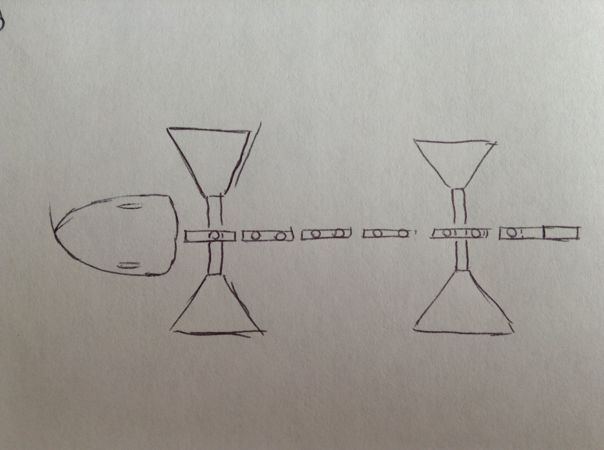

Name: John Kiernan

Student Number: C11343056

I plan to make an animat of a fish while it is swimming. The animat will be able to move like a fish
and also be able to move its flippers and mouth. The animat itself would look like the skeletal 
structure of a fish.

Rigid Bodies and Joints:

Rigid bodies needed are:

-1 for each of the fish's flippers

-A chain of rigid bodies that act together to form the spine

-1 rigid body for the fish's tail

-2 rigid bodies to form the fish's skull, lower and upper parts of jaw

Joint types needed are:

-Some hinge joints or condyloid joints for spinal movement and mouth movement

-To move the head and tail I would need a condyloid joints to make them move from side to side

-Some ball and socket joints for the fins

The power source for the fish would be the provided by the movement of his tail.
When a force moves the tail it will cause the spine of the fish to wriggle and move in
fish or snake like motion.

Diagrams of Fish

